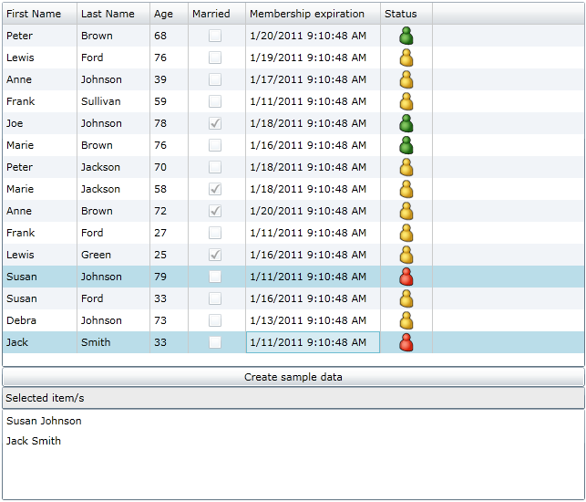

# Silverlight Bindable DataGrid

## Project Description
New control extending the Silverlight DataGrid to enable an easier use of binding objects with DataSource instead of ItemsSource. New classes (DataSet and DataTable) have been created to show how it works.

This is a new Silverlight DataGrid control that allows the user to bind data in a traditional .Net way.

Currently there's no support for DataSet and DataTable in Silverlight, so these two classes have been built in the same component as well, trying to replicate the minimal set of functionality to make everything work. Please note these are not the normal .Net DataSet and DataTable.

Actually binding data to a Silverlight DataGrid is easy with the ItemsSource property as long as it's IEnumerable, but the problem is that it has to define the "rows" previously, that is, the "cells" (properties of each object) have to be known at design time.

With this control and the new classes everything is generated dynamically at runtime (using Reflection to create the objects needed to populate the "rows"). Also, the columns can be defined using the DataColumns prior to binding, so when the data is actually loaded their properties (read only, resizable, sortable, ...) are set automatically too.

*Sample code:*
````csharp
// Create a sample DataTable
DataTable dt = new DataTable("MyDataTable");

// Create a column
DataColumn dc1 = new DataColumn("col1");
dc1.Caption = "First Name";
dc1.ReadOnly = true;
dc1.DataType = typeof(String);
dc1.AllowResize = true;
dc1.AllowSort = true;
dc1.AllowReorder = true;
dt.Columns.Add(dc1);

// Create a column
DataColumn dc2 = new DataColumn("col2");
dc2.Caption = "Last Name";
dc2.ReadOnly = true;
dc2.DataType = typeof(String);
dc2.AllowResize = true;
dc2.AllowSort = true;
dc2.AllowReorder = true;
dt.Columns.Add(dc2);

// Add a row to the table
DataRow dr = new DataRow();
dr["col1"] = "Peter";
dr["col2"] = "Johnson";
dt.Rows.Add(dr);

// Create a DataSet and add the table to it
DataSet ds = new DataSet("MyDataSet");
ds.Tables.Add(dt);

// Do the binding
myBindableDG.AutoGenerateColumns = true;
myBindableDG.DataSource = ds;
myBindableDG.DataMember = "MyDataTable";
myBindableDG.DataBind();
````
## Update
Added support for images in the grid, like in the following screenshot:


To support images, the **AutoGenerateColumns** property must be set to _false_ and we'll create a column like this:

````csharp
// Create a column
DataColumn dc6 = new DataColumn("col6", typeof(Image));
dc6.Caption = "Status";
dc6.ReadOnly = true;
dt.Columns.Add(dc6);

Uri uri = new Uri("Images/UserGreen.png", UriKind.RelativeOrAbsolute);
ImageSource imgSource = new BitmapImage(uri);
Image img = new Image();
img.Source = new BitmapImage(uri);

dr["col6"] = img;
````
Plans include to add more validation and bullet-proof the current code, extend types of datasources, translator between equivalent .Net classes (i.e.: serialize a .Net DataSet so it can be deserialized into this "custom" DataSet to be used by the grid), ...

Thanks to user **KenEucker** on tip for getting SelectedItem property. :-)


You can download the compiled binaries here:

[http://blog.gamosoft.com/silverlight-bindable-datagrid/](http://blog.gamosoft.com/silverlight-bindable-datagrid/)

I hope you enjoy it.

Thank you!
